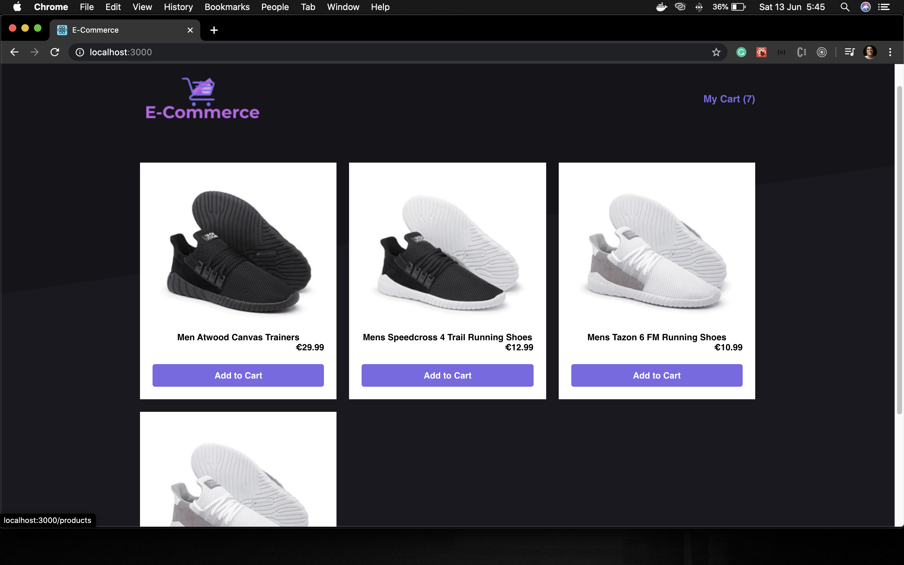
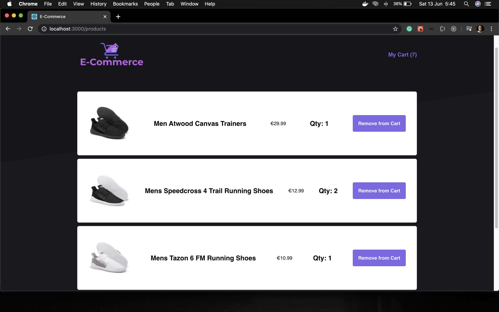
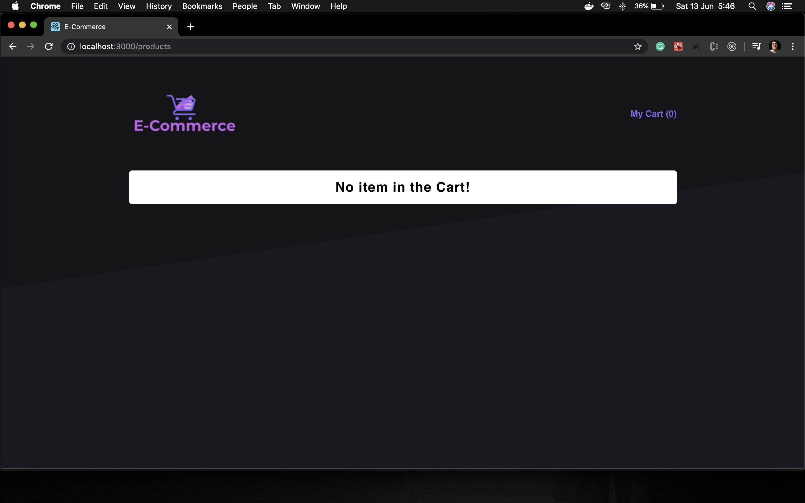

# E-Commerce-Class-Component
Simple exercise with React-Class-Component-with-Redux

## About the project

- This is a simple e-commerce exercise that I built using React Class Component with Redux. 

## The frontend

It was developed with [**_ReactJS_**](https://reactjs.org/) using [**Redux**](https://redux.js.org/) to handle the state with the reducers and the actions.
[**_react-router-dom_**](https://www.npmjs.com/package/react-router-dom) to handle the routes.

**Login**

**Cart**

**Empty Cart**

## Getting started

1.  Prerequisites

- npm

      npm install npm@latest -g

2. Installation

- Clone the repo

      git clone https://github.com/euguilhermegirardi/E-Commerce-Class-Component.git

3. Install NPM packages

       npm install

4. Run the application

       npm run start

## Contributing

1.  Fork the project
2.  Create your feature branch (`git checkout -b feature/AmazingFeature`)
3.  Commit your changes (`git commit -m 'Add some AmazingFeature'`)
4.  Push to the branch (`git push origin feature/AmazingFeature`)
5.  Open a pull request

## License

